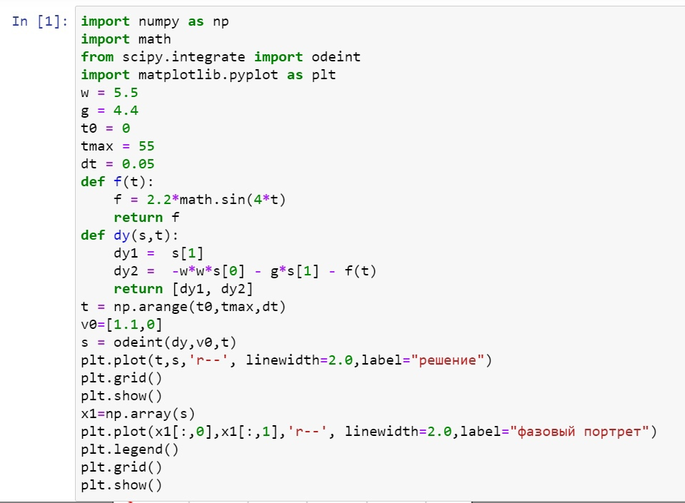
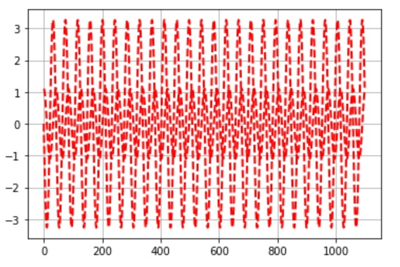
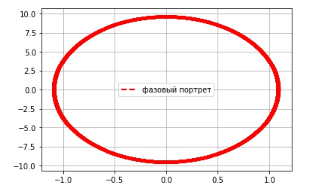
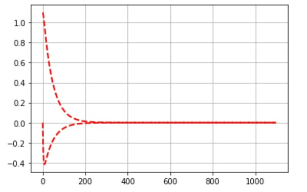
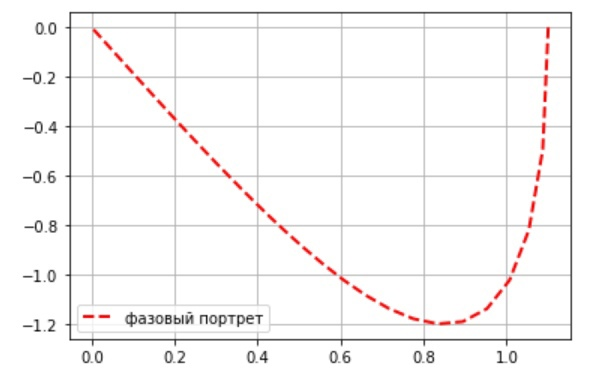
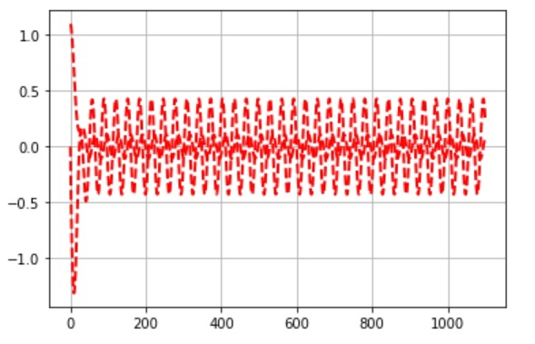
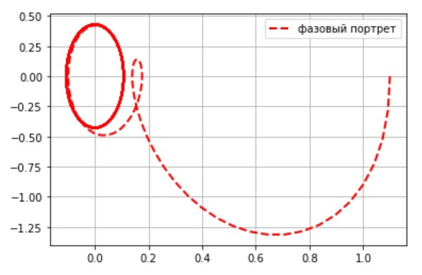

---
## Front matter
lang: ru-RU
title: Модель гармонических колебаний
author: Назарьева Алена НФИбд-03-18
institute:
	inst RUDN University, Moscow, Russian Federation
date: 2021, 25 february
## Formatting
toc: false
slide_level: 2
theme: metropolis
header-includes:
 - \metroset{progressbar=frametitle,sectionpage=progressbar,numbering=fraction}
 - '\makeatletter'
 - '\beamer@ignorenonframefalse'
 - '\makeatother'
aspectratio: 43
section-titles: true
---
# Цель работы

Изучить и реализовать Модель гармонических колебаний

# Выполнение лабораторной работы

## 1)

Код в python для Модели гармонических колебаний (рис. -@fig:007)

{ #fig:007 width=70% }

## 2)
Колебания гармонического осцилятора без затуханий и без действий внешней силы
Решение уравнения гармонического осциллятора (рис. -@fig:001)

{ #fig:001 width=70% }

## 3)

Фазовый портрет гармонического осциллятора (рис. -@fig:002)

{ #fig:002 width=70% }

## 4)

Колебания гармонического осцилятора с затуханием и без действий внешней силы
Решение уравнения гармонического осциллятора (рис. -@fig:003)

{ #fig:003 width=70% }

## 5)

фазовый портрет гармонического осциллятора (рис. -@fig:004)

{ #fig:004 width=70% }

## 6)

Колебания гармонического осцилятора с затуханием и под действием внешней силы
Решение уравнения гармонического осциллятора (рис. -@fig:005)

{ #fig:005 width=70% }

## 7)

фазовый портрет гармонического осциллятора (рис. -@fig:006)

{ #fig:006 width=70% }

# Выводы

В результате проделанной работы я изучила и реализовала модель боевых действий для своего варианта
